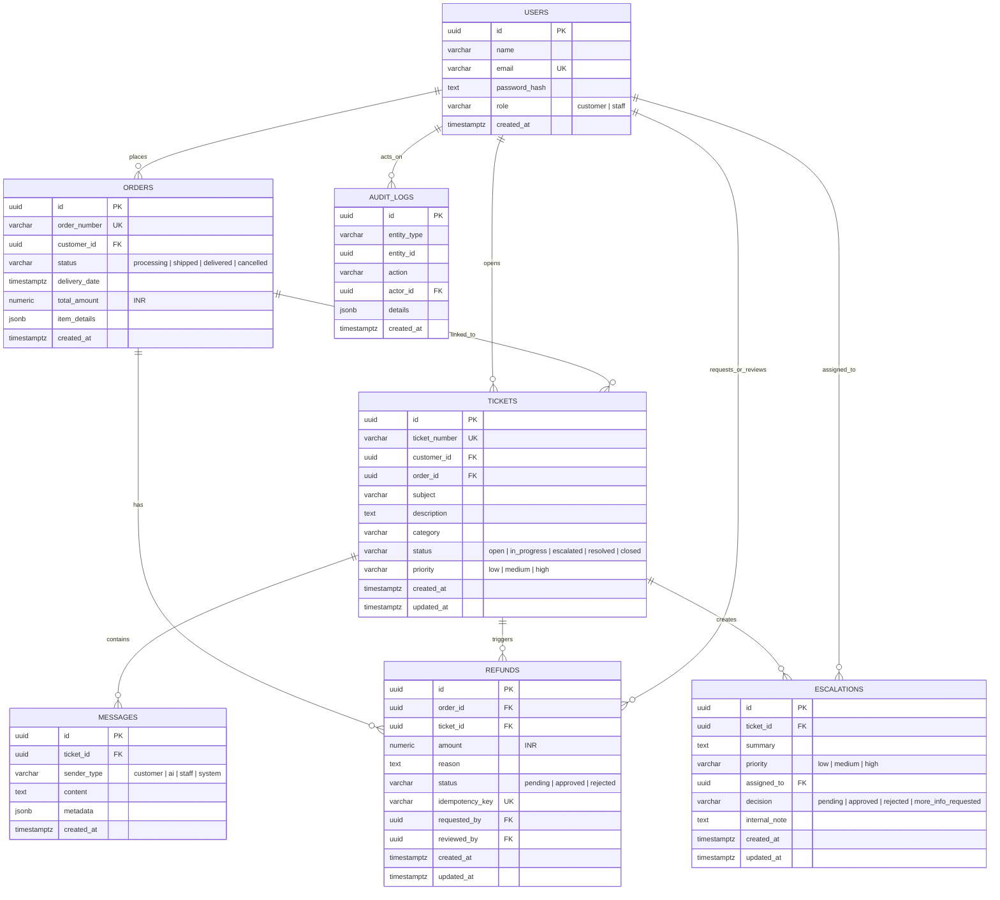

## Database ER Diagram

```mermaid
erDiagram
    USERS ||--o{ ORDERS : places
    USERS ||--o{ TICKETS : opens
    ORDERS ||--o{ TICKETS : linked_to
    TICKETS ||--o{ MESSAGES : contains
    ORDERS ||--o{ REFUNDS : has
    TICKETS ||--o{ REFUNDS : triggers
    USERS ||--o{ REFUNDS : requests_or_reviews
    TICKETS ||--o{ ESCALATIONS : creates
    USERS ||--o{ ESCALATIONS : assigned_to
    USERS ||--o{ AUDIT_LOGS : acts_on

    USERS {
        uuid id PK
        varchar name
        varchar email UK
        text password_hash
        varchar role "customer | staff"
        timestamptz created_at
    }
    ORDERS {
        uuid id PK
        varchar order_number UK
        uuid customer_id FK
        varchar status "processing | shipped | delivered | cancelled"
        timestamptz delivery_date
        numeric total_amount "INR"
        jsonb item_details
        timestamptz created_at
    }
    TICKETS {
        uuid id PK
        varchar ticket_number UK
        uuid customer_id FK
        uuid order_id FK
        varchar subject
        text description
        varchar category
        varchar status "open | in_progress | escalated | resolved | closed"
        varchar priority "low | medium | high"
        timestamptz created_at
        timestamptz updated_at
    }
    MESSAGES {
        uuid id PK
        uuid ticket_id FK
        varchar sender_type "customer | ai | staff | system"
        text content
        jsonb metadata
        timestamptz created_at
    }
    REFUNDS {
        uuid id PK
        uuid order_id FK
        uuid ticket_id FK
        numeric amount "INR"
        text reason
        varchar status "pending | approved | rejected"
        varchar idempotency_key UK
        uuid requested_by FK
        uuid reviewed_by FK
        timestamptz created_at
        timestamptz updated_at
    }
    ESCALATIONS {
        uuid id PK
        uuid ticket_id FK
        text summary
        varchar priority "low | medium | high"
        uuid assigned_to FK
        varchar decision "pending | approved | rejected | more_info_requested"
        text internal_note
        timestamptz created_at
        timestamptz updated_at
    }
    AUDIT_LOGS {
        uuid id PK
        varchar entity_type
        uuid entity_id
        varchar action
        uuid actor_id FK
        jsonb details
        timestamptz created_at
    }
```
